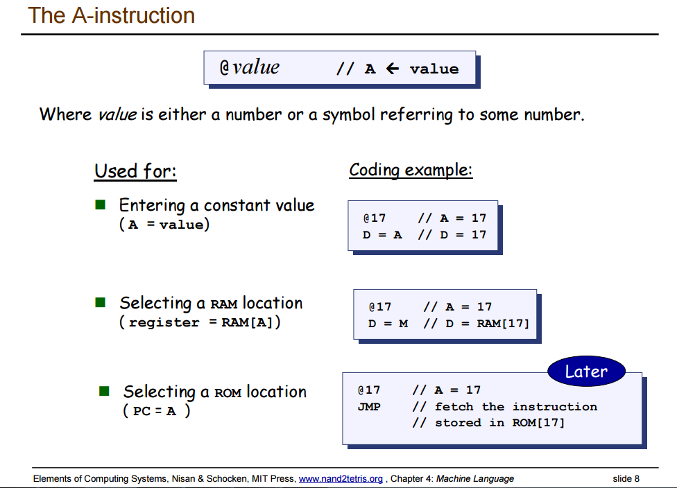

1. @X的意义为把X存入A寄存器，M代表的是Memory[A]，即A所代表的地址中所存的数值，A=M，M=D两句并列意味着将D中数据存入Memory[A]，这是这一章中用得最多的逻辑语句。
其中D，A为寄存器的名字，M代表内存单元, A寄存器的用法如下；
  

2. 在实现eq，gt，lt时，需要用汇编语言实现If的选择功能，这里需要用到两个lable，一个有条件jump，一个无条件jump，代码实现为：

```assembler
// Compare R1=R2 set result in R3  
@SP  
M=M-1  
A=M  
D=M  
@SP  
M=M-1  
A=M  
D=D-M  
@RET_TRUE  
D;JEQ  
D=0         // need to return False  
@CONTINUE  
0;JMP  
(RET_TRUE)  
D=-1        // need to return True  
(CONTINUE)  
@SP  
A=M  
M=D  
@SP  
M=M+1  
```